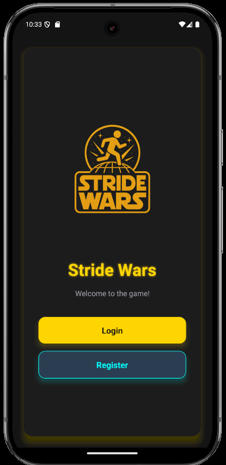
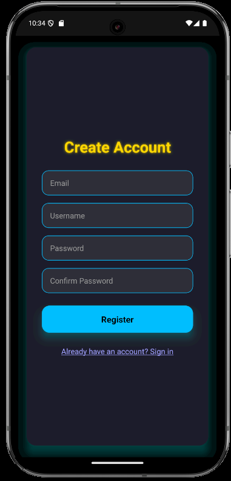
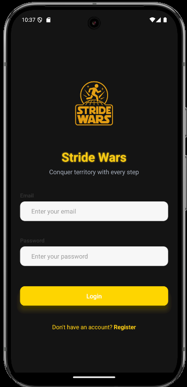
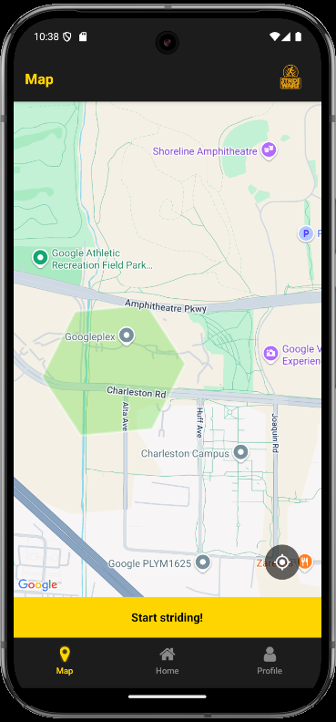
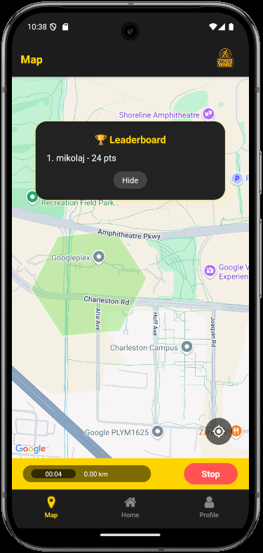
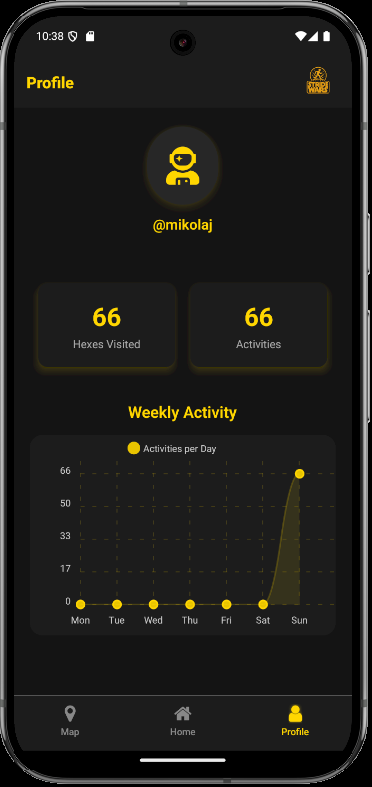
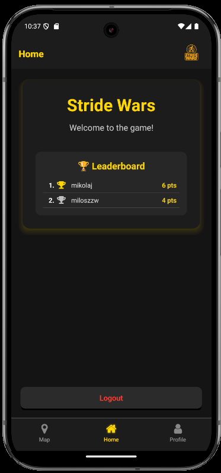

# Stride Wars - Territory Takeover Application


<p align="center">
  
  
  
  
  
  
  
</p>

---

Stride Wars is a territory takeover application where users capture hexagonal map areas through real-world activities like walking, running, or rollerblading. By tracking GPS movements, players compete to dominate territories and climb leaderboards.

## Table of Contents
1. [Features](#features)
2. [Technology Stack](#technology-stack)
3. [Installation](#installation)
4. [Configuration](#configuration)
5. [Application Screens](#application-screens)
6. [Game Mechanics](#game-mechanics)
7. [Development](#development)
8. [Testing](#testing)
9. [Deployment](#deployment)
10. [Contributing](#contributing)

## Features
- 🗺️ Interactive hexagon-based map overlay
- 🏃 Real-time activity tracking with GPS
- 🏆 Hexagon-specific leaderboards
- 📊 User statistics and global rankings
- 🔐 Secure authentication with email verification
- ⏱️ Activity recording with time and distance tracking
- 📈 7-day activity visualization

## Technology Stack

### Frontend (Mobile)
- **React Native** (TypeScript)
- Expo Location Services
- React Native Maps
- H3-JS for hexagon geospatial indexing
- Async Storage

### Frontend (Web)
- **Angular** (TypeScript)
- RxJS for state management

### Backend
- **Go** (1.24+)
- Gin Web Framework
- H3-Go for geospatial processing

### Database
- **Supabase** (PostgreSQL)
- PostGIS for geospatial queries

### Dependencies
- Yarn (package manager)
- Go Modules

## Installation

### Prerequisites
- Go 1.24+
- Node.js 16+
- Yarn: `npm install -g yarn`
- Expo CLI: `npm install -g expo-cli`
- Supabase account

### Mobile App Setup
```bash
# Clone repository
git clone https://github.com/your-org/stride-wars.git
cd stride-wars/mobile

# Install dependencies
yarn install

# Start development server
npx expo run:android # or :ios

```

### Backend Setup
```bash
cd ../backend

# Install Go dependencies
go mod download

# Build and run
make run
```

## Configuration

Create a `.env` file in the `backend` directory:

```env
# Supabase Configuration
SUPABASE_URL=https://your-project.supabase.co
SUPABASE_KEY=your-supabase-service-key
SUPABASE_JWT_SECRET=your-jwt-secret

# Server Configuration
SERVER_PORT=8080
ENVIRONMENT=development
```

## Application Screens

### Registration
**Registration Screen:**  
Users register with username, password, and email. Email verification is required.




### Login
**Login Screen:**  
Secure authentication with credentials.



### Map View
**Map Screen:**
- Hexagonal territory overlay on real map
- Start/stop activity tracking
- Leaderboard access for each hexagon
- Real-time location tracking




### Statistics
**Statistics Screen:**
- Visited hexagon count
- Activity statistics
- 7-day activity chart



### Global Leaderboard
**Leaderboard Screen:**  
Top 10 players with the most dominated hexagons



## Game Mechanics

### Map Division
- World map divided into hexagons
- Each hexagon ≈ 105,000 m² (side ≈ 201m)
- Players capture hexagons by moving through them

### Scoring System
Each hexagon visit earns points based on:

```
Score = ReLU(1 - 0.1 * (tc - tl)) * Scorec + 1
```
Where:
- **Score** = New score
- **tc** = Current time (weeks)
- **tl** = Last visit time (weeks)
- **Scorec** = Current score

The formula rewards frequent visits and penalizes infrequent players.

### Leaderboards
Each hexagon maintains:
- Top 5 most frequent visitors
- Real-time ranking updates
- Player dominance indicators

## Development

### Project Structure
```
stride-wars/
├── frontend/        # React Native Expo app
├── backend/         # Go server
├── h3-utils/        # Shared geospatial utilities
└── supabase/        # Database schemas and migrations
```

## Contributing

1. Fork the repository
2. Create a feature branch: `git checkout -b feature/new-feature`
3. Commit your changes: `git commit -m 'Add new feature'`
4. Push to your branch: `git push origin feature/new-feature`
5. Create a pull request

## Testing

```bash
# Run Go tests
cd backend
make test
```